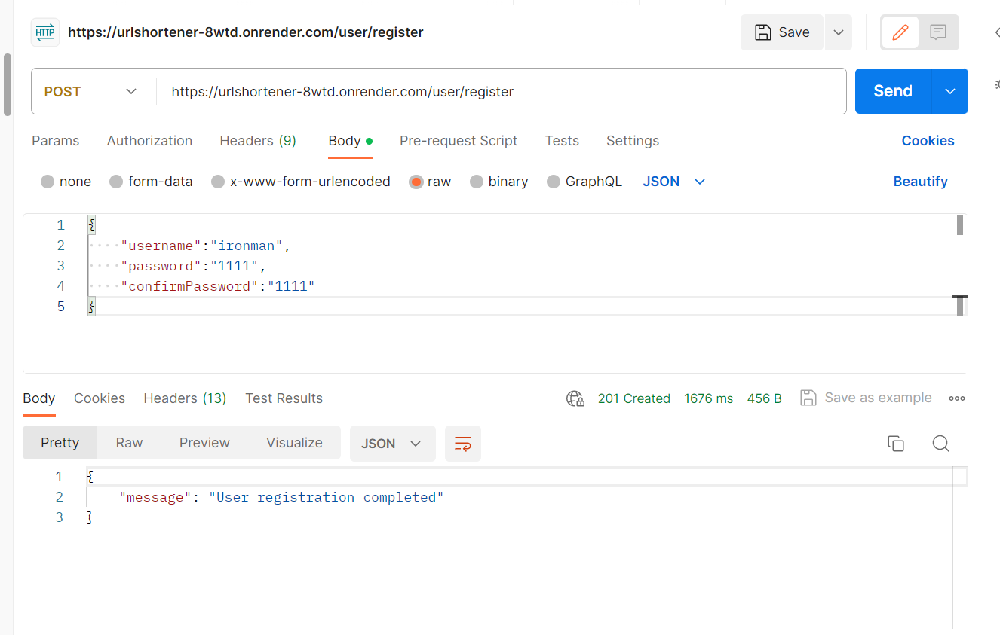
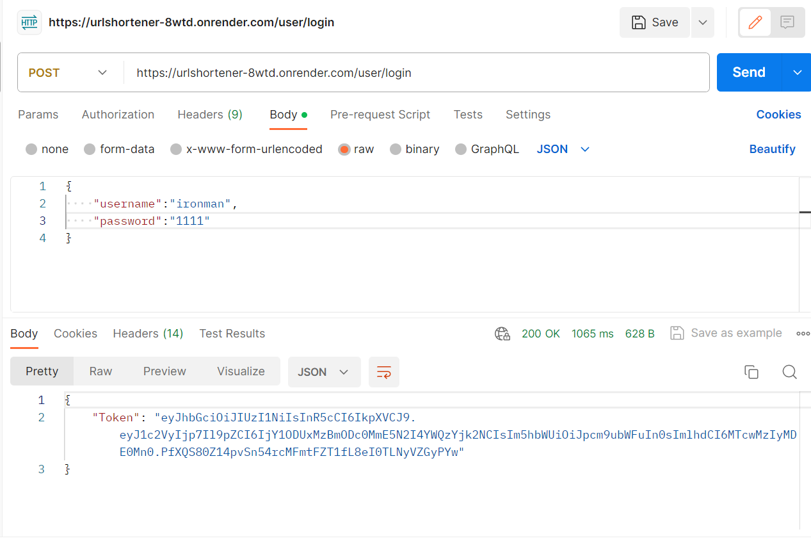
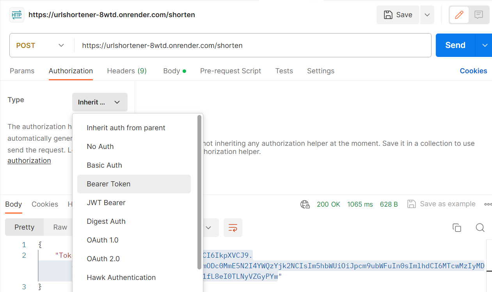
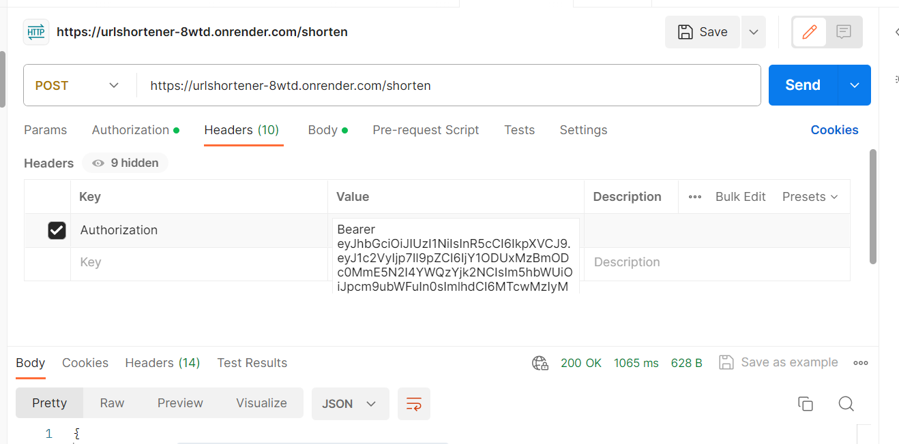
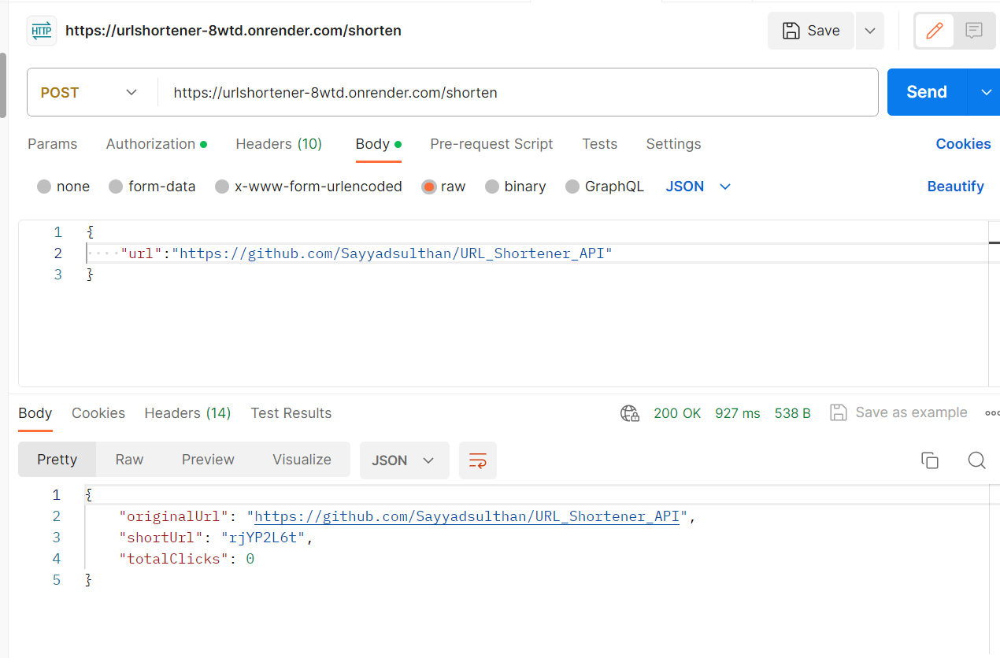
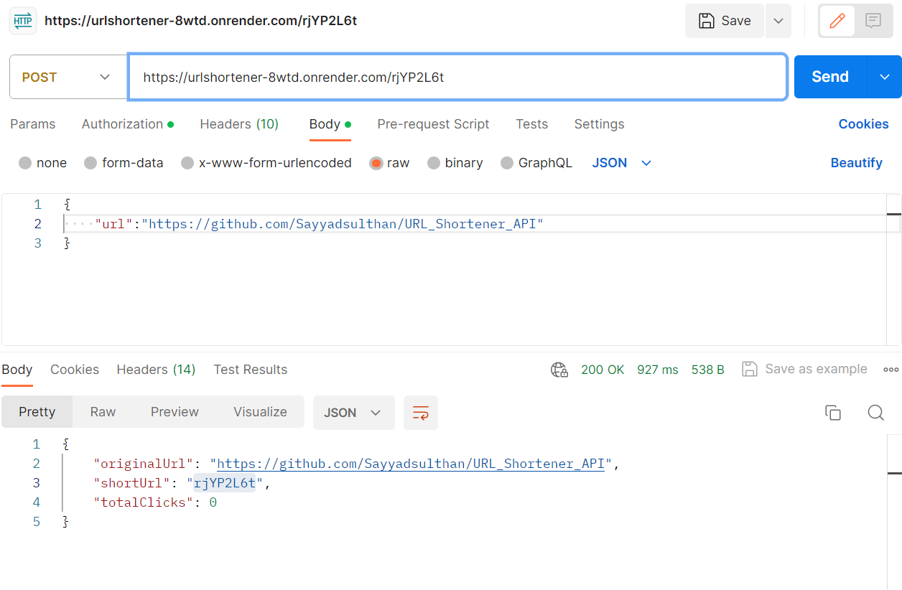
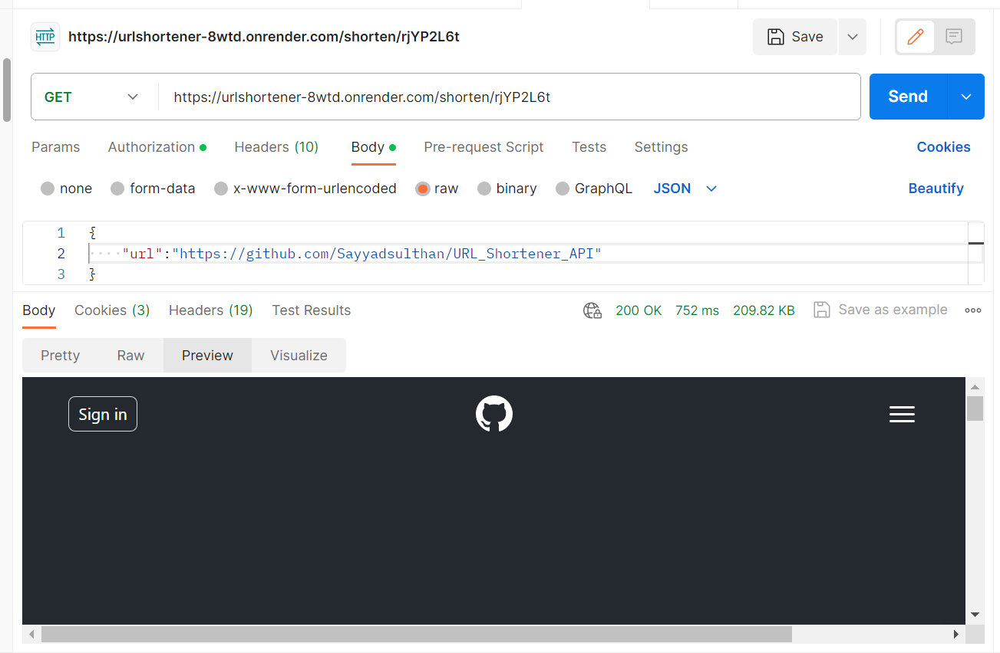

# URL Shortener API

<!-- First user need to Follow the Registration process  -->

# For Testing API Use PostMan

# API Routes are :

    1. POST  https://urlshortener-8wtd.onrender.com/user/register
        {
            "username":"abc",
            "password":xxx
            "confirmPassword":xxx
        }

    2. POST  https://urlshortener-8wtd.onrender.com/user/login
        {
             "username":"abc",
            "password":xxx
        }

    3. POST  https://urlshortener-8wtd.onrender.com/shorten
        <!-- Provide Token which generated in login route -->
        <!-- IN Headers Authorization: Bearer Token -->
        {
            "url":"https://www.google.com/"
        }

    4. GET  https://urlshortener-8wtd.onrender.com/(ShortUrlId) xxxx
         <!-- Provide Token which generated in login route -->
        <!-- IN Headers Authorization: Bearer Token -->

# Follow the Screen Shots for easy understand

# Register

    

# Login

    

# Create the Short URL

    

    <!-- For Authentication use Authorization in key and value Bearer token -->

    

    

# For use of the link

   <!-- Authentication steps are same as create short Url -->

    Put the shortUrl on routes last end

    

    

    # Thank You for Reading.

    Fork this project and run on your system
